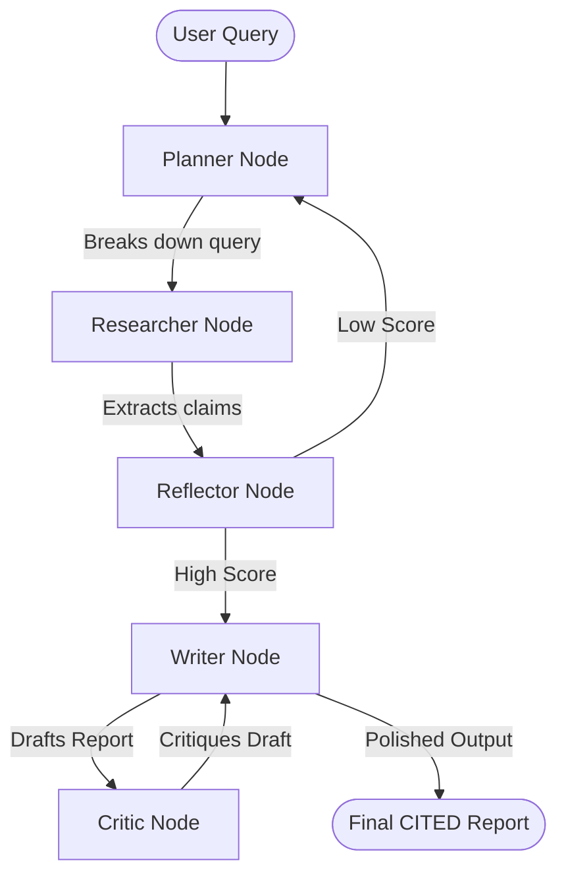

# MADRA: Multi-Agent Deep Research Architecture 🧠

**🟢 Live Demo:** [https://madra-5qwt.onrender.com/](https://madra-5qwt.onrender.com/)

MADRA is a multi-agent research system built with **LangGraph** and **FastAPI**. It uses parallel web scraping, critical analysis, and self-refining report generation to answer complex queries.


## ✨ Key Features
- **Concurrent Web Research**: The `Researcher` agent uses `asyncio` to scrape multiple URLs and extract facts in parallel.
- **Actor-Critic Refinement Loop**: An internal `Critic` agent acts as an editor, automatically reviewing draft reports for factual consistency and clarity, forcing a rewrite before the final output.
- **Academic Citation System**: Automatically injects inline markdown footnotes (e.g. `[1]`) into factual claims and generates a comprehensive `## References` section.
- **Real-Time Streaming UI**: Built with FastAPI Server-Sent Events (SSE) and **Loquix Web Components**, the frontend displays exactly which agents are working and how long they take in real time.
- **Smart Caching**: Implements `diskcache` to store previously extracted web claims locally, saving API tokens and speeding up repeated queries.

## 🏗️ Agent Architecture



## 🚀 Setup & Execution

1. **Clone the repository:**
   ```bash
   git clone https://github.com/Mansi091/MADRA.git
   cd MADRA
   ```

2. **Install dependencies:**
   ```bash
   uv pip install -r requirements.txt
   ```

3. **Set your Environment Variables:**
   ```bash
   export GROQ_API_KEY="your_api_key_here"
   ```

4. **Run the Application:**
   ```bash
   uv run uvicorn app:app --reload
   ```
   Open `http://127.0.0.1:8000` in your web browser.
